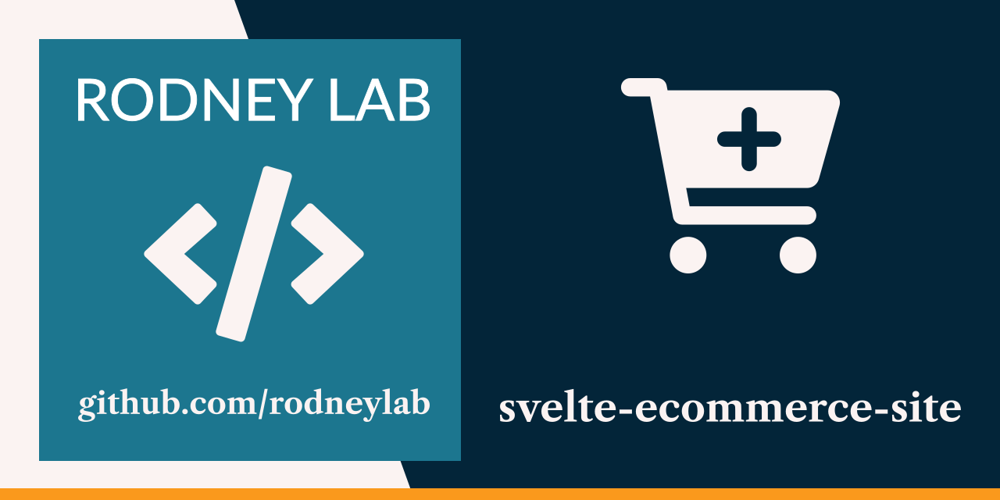

  

<h1 align="center">
  Svelte eCommerce Site Start
</h1>

## svelte-ecommerce-site-start

Starter code for the <a aria-label="Open the Svelte e Commerce Site tutorial" href="https://plus.rodneylab.com/tutorials/svelte-ecommerce-site">Svelte eCommerce Site tutorial</a>. Head over there to get started! Also see the <a aria-label="Open the Demo Svelte eCommerce Site" href="https://sveltekit-ecommerce-site.rodneylab.com/">Demo site for finished storefront</a>.

## 🧱 Svelte eCommerce Site: What We&rsquo;re Building

We will build out an small online lego store using SvelteKit for the frontend, Snipcart to manage the checkout and Directus for storing our lego product details and images. The store will have the basic pages you expect from a an eCommerce store, linking them hierarchically in an SEO friendly way recommended by Google. That&rsquo;s not the end of the SEO side of things though! We see how you can let Google and other search engines know about product prices, reviews and where the images are. With the right information Google will be able to create featured snippets in search results. These let your eCommerce store stand out from others returned in results. We will also use edge functions paired with Directus search capability to add a quick search facility without the need to add an external service or host you own Open Source search instance.

Pop open the <a aria-label="Open teh Demo Svelte eCommerce site demo" href="https://sveltekit-ecommerce-site.rodneylab.com/">Svelte eCommerce site demo</a> to take a look yourself.

## 👍🏽 Svelte eCommerce Site: What we will Cover

> **What we cover**:
>
> - New **SvelteKit routing API**,
> - integrating **Snipcart checkout** state with Svelte stores,
> - **Svelte flip animations** for dynamic product pages,
> - uploading product data to **Directus** using your **existing JSON** files,
> - using **Netlify Edge functions** to add Middleware,
> - querying Directus SQL database the **TypeScript friendly** way,
> - generating **responsive, NextGen images** for products using the Directus API,
> - adding **eCommerce Schema.org** markup to improve site SEO,
> - **product search feature** using Directus API and edge functions,
> - **generating Base64 encoded low res placeholder images** in SvelteKit and Deno edge functions,
> - **deploying to Netlify and testing** SEO.

## ⛔️ What we won&rsquo;t Cover

- SvelteKit basics: check out the <a aria-label="Open beginner Svelte tutorial" href="/tutorials/starting-out-svelte-sveltekit">Starting out Svelte and SvelteKit tutorial if this tutorial</a> starts too quickly for you,
- order fulfilment, though if you can integrate a service like <a aria-label="Learn more about print ful" href="https://www.printful.com/uk">Printful to help with fulfilment, packing and shipping</a>,
- finding clients to build eCommerce sites for &mdash; that&rsquo;s down to you!

## 😕 Still not sure if it&rsquo;s for you?
Jump into the [Rodney Lab matrix chat room](https://matrix.to/#/%23rodney:matrix.org) to get your questions answered.
